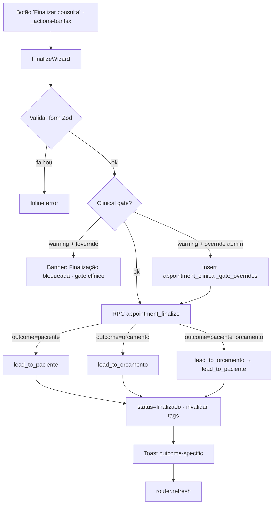
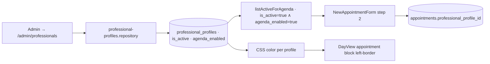
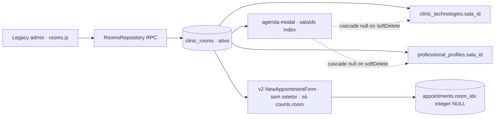
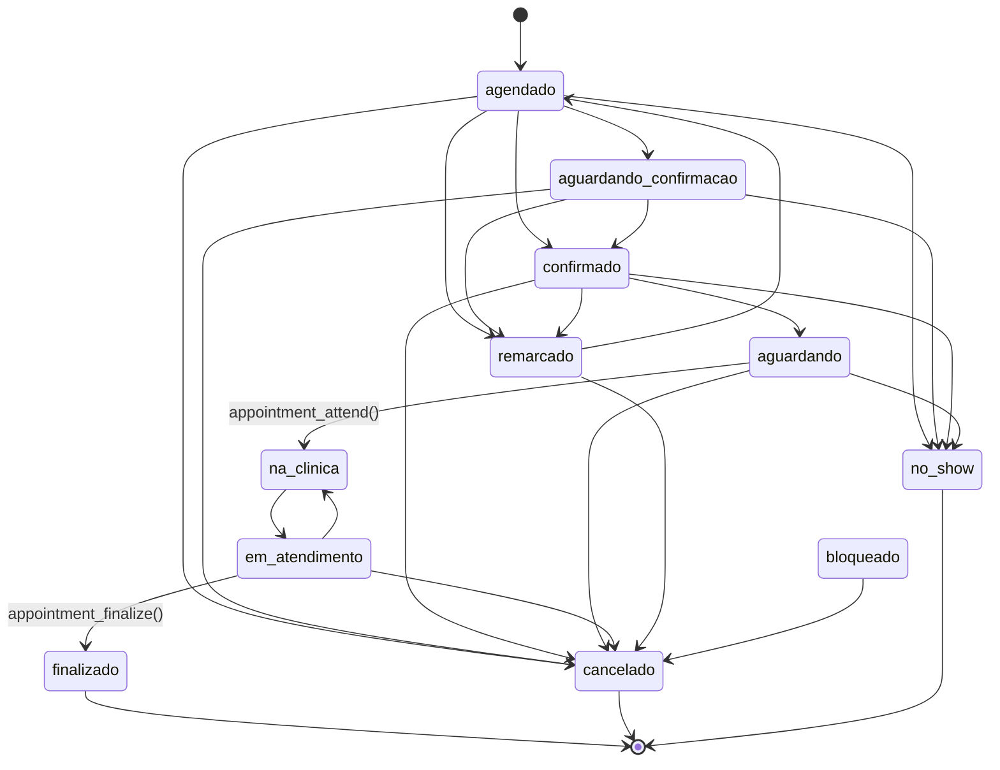
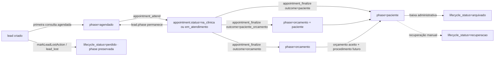

# CRM DEEP RULES · VALIDATIONS · GRAPH AUDIT · 2026-05-18

> **Mode:** READ-ONLY audit · ZERO patch · ZERO commit · doc-only.
> **Authors:** Claude (sob ordem GO CRM_DEEP_RULES_VALIDATIONS_GRAPH_AUDIT_CONTINUE_FROM_PHASE_4).
> **Scope:** 1×1 comparison between **legacy CRM** (`clinic-dashboard`, vanilla JS) and **new CRM v2** (`clinicai-v2`, Next.js 16 + React 19 + TS + Tailwind 4 + Supabase) covering: rules, validations, business logic, UI states, tooltips, alerts, drag/drop, status state machine, procedures, rooms, professionals, payments, multi-procedure, retorno, anamnese, consentimento, post-consulta, leads/orcamentos/pacientes/perdidos, alertas internos, fluxos finalize.

---

## Phase 0 · Precheck

| Repo | HEAD | Branch status |
|------|------|---------------|
| `clinic-dashboard` | `d991418` | clean (graphify-out/ + cli-latest tracked separately) |
| `clinicai-v2`     | `2b157f9` | clean (test-results untracked) |

Graphify graphs disponíveis em ambos repos (10 191 nodes legacy / 1 917 nodes v2). Doc destino: `clinicai-v2/docs/crm-refactor/` (compartilhado com docs 00-… até 108-…).

---

## Phase 4 · FINALIZATION_MODAL_MATRIX (legacy `agenda-smart.finalize.js` × v2 `_actions-bar.tsx` + `_clinical-panel.tsx`)

### 4.1 Entry points

| Aspect | Legacy | v2 |
|--------|--------|----|
| Entry function | `openFinalizeModal(id)` · `js/agenda-smart.finalize.js:21` | Botão `"Finalizar consulta"` em `apps/lara/src/app/crm/agenda/[id]/_actions-bar.tsx:198-208` (abre `FinalizeWizard` linhas 338-353) |
| Aliases | `quickFinish(id)`, `openFinishModal(id)`, `closeFinishModal()`, `confirmFinishAppt()` · `js/agenda-finalize.js:20-44` | — |
| Pre-conditions | Status ∈ `{na_clinica, em_consulta, aguardando, confirmado, agendado}` · `js/agenda-validation.js:409` (validação deferida pro confirm) | `actionFlags.canFinalize` = `status === 'na_clinica' || status === 'em_atendimento'` · `packages/repositories/src/helpers/appointment-state.ts:121` |
| Idempotência | `_finalizingInProgress` flag · auto-reset 3 s | RPC `appointment_finalize` retorna `idempotent_skip: true` se já finalizado · `db/migrations/20260800000167_*.sql:169-176` |

### 4.2 Outcomes (rotas de saída)

| Outcome | Legacy | v2 |
|---------|--------|----|
| `paciente` | Marca consulta finalizada · `SdrService.changePhase(paciente, 'paciente', 'finalizacao')` · aplica tags `consulta_realizada` + `procedimento_realizado` | RPC `lead_to_paciente(p_lead_id, …)` · invalida tags `appointments`, `leads`, `patients`, `phase_history` |
| `pac_orcamento` / `paciente_orcamento` | Phase `paciente` + tag `orcamento_aberto` | Sequencial: `lead_to_orcamento` PRIMEIRO → `lead_to_paciente` DEPOIS (atômico via RPC) |
| `orcamento` | Phase `orcamento` + tag `orc_em_aberto` | RPC `lead_to_orcamento` apenas |
| `nenhum` (apenas finalizar) | Status `finalizado` · sem phase change · sem tag | **NÃO existe em v2** (rota `nenhum` removida) |
| `perdido` | **NÃO existe em finalize legacy** (perdido vive em `js/perdidos*.js` separado) | Bloqueado em `appointment_finalize` (PATCH_0C_FINALIZE_BACKEND_GUARD em `apps/lara/src/app/crm/_actions/appointment.actions.ts:489-501`) · fluxo correto = `markLeadLostAction()` chama RPC `lead_lost` separadamente |

### 4.3 Validações sincrônicas

#### Legacy (`confirmFinalize` linha 942-1064)
- `Informe o valor total` (forma≠cortesia ∧ valor≤0)
- `Status 'Pago' mas valor pago e zero` (statusP='pago' ∧ pago≤0)
- `Informe o motivo da cortesia` (forma='cortesia' ∧ motivo vazio)
- `Informe o nome do convenio`
- `Informe o valor da entrada` + `Informe o vencimento do saldo`
- `Informe o 1o vencimento do boleto` (parcelas>1)
- `Selecione o proximo estado do paciente (Bloco 4)` (route='nenhum')
- `Avaliação paga exige valor definido.` + `Avaliação paga: registre o pagamento (parcial ou total) antes de finalizar.`
- `Os procedimentos a seguir estão com valor R$ 0,00 e não estão marcados como cortesia: {nomes}. Ajuste o valor ou marque cortesia antes de finalizar.` (P2.3D.1)
- `Esta consulta ja foi finalizada anteriormente.` (idempotência)

#### v2 (Zod + RPC)
- `Subtotal do orçamento obrigatório (>0)` (cliente)
- `Motivo da cortesia obrigatório (mínimo 3 caracteres)` (cliente · Zod refine `appointment.schemas.ts:353-364`)
- `value deve ser 0 (ou null) quando paymentStatus=cortesia` (Zod refine 366-378)
- `clinicalOverrideReason obrigatorio (min 5 chars) quando clinicalOverride=true` (Zod refine 337-351)
- `orcamentoItems (>=1) + orcamentoSubtotal obrigatorios quando outcome=orcamento ou paciente_orcamento` (Zod refine 320-336)
- Códigos de erro RPC (mig 167): `invalid_outcome`, `lost_reason_required` (legacy guard), `invalid_payment_status`, `orcamento_subtotal_required`, `orcamento_items_array_required`, `invalid_orcamento_discount`, `invalid_status_for_finalize`, `lost_requires_lead`, `cannot_create_budget_without_lead`, `clinical_gate_required`, `override_reason_required`, `override_permission_denied`, `patient_conversion_failed`, `budget_creation_failed`, `patient_conversion_failed_after_budget`, `lead_lost_failed`

### 4.4 Pagamento

| Aspect | Legacy | v2 |
|--------|--------|----|
| Formas | 10 dinâmicas (`pix`, `dinheiro`, `debito`, `credito` (à vista/parcelado), `parcelado`, `entrada_saldo`, `boleto`, `link`, `cortesia`, `convenio`) | Single enum: `pendente / parcial / pago / cortesia / isento` (mig 152) |
| Multi-pagamento | `appt.pagamentos[]` · merge no schema (`_detalhesToPagamento`) | **NÃO suportado** · single payment_status por appointment |
| Cortesia vs Isento | Apenas `cortesia` (com motivo) | Distintos: cortesia (motivo obrigatório) ≠ isento (parceria/convênio) |
| Desconto procedimento | `finDescontoCb` + `finDescontoVal` por item | Apenas `orcamento_discount` global |
| Total auto-calc | Sim (consulta paga → vira cortesia ao fechar procedimento) | Apenas `subtotal - discount` para orçamento |

### 4.5 Bloco clínico (hard gate · mig 167)

| Aspect | Legacy | v2 |
|--------|--------|----|
| Anamnese | Fora do modal (módulo `anamnese.js`) | Painel intra-consulta (`_clinical-panel.tsx`) · estados: `none`, `draft`, `complete`, `archived` |
| Consentimento procedimento | Fallback button (`_finSendConsentProc`) · envia via WA | TCLE simplificado no modal · `acceptAppointmentConsentAction()` |
| Hard gate | **AUSENTE** · finalize sempre permitido | RPC bloqueia `clinical_gate_required` se `anamnesis≠complete ∨ consent.signed=false` · override permitido só para owner/admin com motivo ≥5 chars + audit em `appointment_clinical_gate_overrides` |
| Mensagem bloqueio | — | `"Finalização bloqueada · gate clínico: [Anamnese {status} (precisa estar completa)], [Consentimento informado não registrado]. Preencha pelo painel clínico acima OU use override admin abaixo (somente owner/admin)."` |

### 4.6 Side effects pós-confirm

| Side effect | Legacy | v2 |
|-------------|--------|----|
| Status appointment | `finalizado` | `finalizado` |
| Phase do lead | `SdrService.changePhase()` (manual) | RPC sub-call (`lead_to_paciente` / `lead_to_orcamento`) |
| `clinic_op_tasks` (cobrança) | Cria task se forma ∈ `{boleto, parcelado, entrada_saldo, link}` ∧ saldo aberto | **AUSENTE** em v2 |
| Cashflow | `CashflowService.createFromAppointment()` (se pago>0) | **AUSENTE** em v2 |
| Queixas | `ComplaintsPanel.saveComplaint()` por queixa marcada | **AUSENTE** em v2 |
| Documentos legais | `LegalDocumentsService.autoSendForStatus()` | **AUSENTE** em v2 (consent é intra-consulta agora) |
| Tags engine | `TagEngine.applyTag()` (consulta_realizada, procedimento_realizado, orcamento_aberto, orc_em_aberto) | Substituído por invalidação de tags do Next.js cache (`CRM_TAGS.appointments`, etc.) |
| VPI auto-enroll | `VPIEngine.autoEnroll()` + `closeIndication()` | **AUSENTE** em v2 |
| Retoques suggestion | `RetoquesEngine.openSuggestionModal()` | **AUSENTE** em v2 |
| Avaliação Google | Auto-task em D+3 via automation rule | **AUSENTE** em v2 |
| WA pós-atendimento | `sendWATemplate(id, 'pos_atendimento')` se checkbox marcado | **AUSENTE** em v2 |

### 4.7 Confirm dialog + UX

| Aspect | Legacy | v2 |
|--------|--------|----|
| Confirm | `confirm(resumo)` nativo com bullet de procedimentos + valor + forma + destino | — (submit direto após validação) |
| Toast sucesso | `"Finalizado", "${pacienteNome} finalizado com sucesso", "success"` | `"Lead promovido a paciente!"` / `"Orçamento criado!"` / `"Lead virou paciente E orçamento criado!"` |
| Toast warning sub-call | — | `"Consulta finalizada · mas conversão '{outcome}' falhou. Verifique manualmente."` |
| Reload pós-fechar | `renderAgenda()` + `openApptDetail(id)` (80 ms) | `router.refresh()` via `onSuccess()` callback |

---

## Phase 5 · PROCEDURE_DATA_LINEAGE + ROOM_DATA_LINEAGE

### 5.1 PROCEDURE_DATA_LINEAGE

**Tabela canônica:** `public.clinic_procedimentos` (mig `20260541000000`) + extensão comercial `public.clinic_procedimentos_comercial` (mig `20260700000864`).

#### Legacy
- **CRUD admin:** RPC `get_procedimentos(p_apenas_ativos)` / `upsert_procedimento` / `soft_delete_procedimento` · `js/repositories/procedimentos.repository.js`
- **Cache:** `window.ProcedimentosCache.get()` (session) + `PROC_SEEDS` hardcoded em `js/procedimentos.js` (~44 procedimentos)
- **Pricing tiers:** `preco` · `preco_promo` · `combo_valor_final` · `combo_desconto_pct` · `combo_bonus` · RPC `procedures_with_partner_pricing(p_lead_id)` (parceiros VPI)
- **Multi-procedure:** `_apptProcs[]` array no appointment · cada item com `{nome, valor, cortesia, cortesiaMotivo, retornoTipo, retornoIntervalo, fases}`
- **Validações chave:** zero-cortesia bloqueante (msg `Os procedimentos a seguir estão com valor R$ 0,00 e não estão marcados como cortesia: …`), procedimento sem motivo de cortesia, retorno sem intervalo, multi-proc em 1 h gera dialog de duração (`O tempo pode nao ser suficiente para todos os procedimentos. Escolha uma opção para continuar:`)
- **Insumos:** junction `procedimento_insumos` (qtd_por_sessao por `clinic_injetaveis`) — exposto no `get_procedimentos` jsonb

#### v2
- **CRUD admin:** `packages/repositories/src/procedure-admin.repository.ts` (SELECT direto · sem RPC) · `list`, `getById`, `listCategorias`, `getCounts` · CREATE/UPDATE/DELETE inexistentes em v2 ainda (usa RLS legacy via SDK direta)
- **Copilot read-only:** `ProcedureRepository.getCommercial(p_only_revisado)` via RPC `get_procedimentos_comercial` (mig 869) · guardrail `procedure.repository.ts:10-14` bloqueia exposição de `preco`, `preco_promo`, `custo_estimado`, `combo_valor_final`, `margem`, `tecnologia_custo`, `partner_pricing_json`
- **Appointment binding:** mig 62 grava `procedure_name text` (snapshot) + mig 182 adiciona `procedure_id uuid` (FK opcional, ainda não usado pela UI)
- **Multi-procedure:** **NÃO suportado** · `CreateAppointmentInput` aceita só `procedureId? + procedureName?`
- **Pricing tiers:** apenas `preco` + `preco_promo` lidos no admin; partner pricing/combo **não exposto** no form
- **Cortesia per-procedimento:** **NÃO suportado** · cortesia é nível appointment via `payment_status='cortesia'`
- **Validações chave:** `__manual__` sentinel para procedimento livre · duração deduzida do `endTime - startTime` (não usa `duracao_min`) · sem multi-proc warning · conflict count via `checkAppointmentConflictAction`

### 5.2 ROOM_DATA_LINEAGE

**Tabela canônica:** `public.clinic_rooms` (mig `20260537000000`).

#### Legacy
- **CRUD:** `RoomsRepository.getAll() / upsert(p_id, p_nome, p_descricao, p_alexa_device_name) / softDelete` · `js/repositories/rooms.repository.js`
- **Consumidor:** `js/agenda-modal.js:120-129` (select dropdown · index-based) · `js/agenda-validation.js:293-310` (conflict detection com mensagem `Conflito de sala: {nome} já está ocupada — {detalhes}.`)
- **Auto-link prof→sala:** `agenda-modal.js:1425-1440` cascateia `prof.sala_id`
- **Cascade delete:** ao desativar sala, delinka `clinic_technologies.sala_id` + `professional_profiles.sala_id` (set NULL)

#### v2
- **CRUD admin:** **AUSENTE** · ainda depende de RPCs legacy via SDK direta
- **Consumidor:** `apps/lara/src/app/crm/agenda/novo/_form.tsx` exibe apenas `counts.room` (`{N} appointment(s) na mesma sala`) — sem seletor de sala
- **Schema appointments:** mig 62 grava `room_idx integer NULL` (mesmo index-based legacy) · **falta FK `room_id uuid`**
- **Auto-link prof→sala:** **AUSENTE** em v2

### 5.3 GAP_LIST_PROCS_ROOMS

| ID | Componente | Severidade |
|----|------------|------------|
| G01-PROC | Multi-procedure por appointment | **HIGH** |
| G02-PROC | Cortesia por procedimento (motivo) | **HIGH** |
| G03-PROC | Retorno (intervalo de sessões) por procedimento | **MEDIUM** |
| G04-PROC | FK `procedure_id` no appointment não usada | **MEDIUM** |
| G05-PROC | Partner pricing / combos | **MEDIUM** |
| G06-PROC | Phases (fases jsonb) | **MEDIUM** |
| G07-PROC | Multi-proc warning (1 h slot) | **MEDIUM** |
| G08-PROC | Procedure insumos (qtd_por_sessao) | **LOW** |
| G09-ROOM | Seletor de sala no form v2 | **HIGH** |
| G10-ROOM | FK `room_id uuid` (atualmente `room_idx integer`) | **MEDIUM** |
| G11-ROOM | Mensagem detalhada de conflict de sala | **LOW** |
| G12-ROOM | Auto-link prof→sala | **LOW** |
| G13-ROOM | Alexa device name | **LOW** |

---

## Phase 6 · UI_STATE_RULES_MATRIX

### 6.1 Componentização

| Aspect | Legacy | v2 |
|--------|--------|----|
| Empty state | Texto inline ad-hoc (`"Nenhum lead encontrado"`, `"Nenhum procedimento adicionado"`, `"Nenhuma queixa pendente"`) | `<EmptyState variant="leads|patients|orcamentos|generic" />` em `packages/ui/src/components/empty-state.tsx:250-355` · Cormorant Garamond italic + SVG + CTA |
| Loading | Sincrônico do localStorage · sem skeleton | `<Skeleton variant="list|card|kpi|text-line" count={N} />` shimmer-luxury 1.8 s |
| Error inline | `_showInlineAlert(title, items, parentId)` (sticky red bg `#FEF2F2`) + `showValidationErrors(errs, title)` (modal overlay vermelho) | Toast via `toast.fromResult(r, { successMsg, errorMessages })` · `packages/ui/src/components/toast.tsx:37-54` |
| Toast | `window._showToast(title, msg, type)` (4 types) | `useToast()` hook · `success / error / warning / info` · auto-dismiss 4 s |
| Confirm | Native `confirm()` (4-12 callsites em legacy) | `<Modal>` controlado · ESC se `dismissable=true` |
| Modal | `modal-system.css` + inline HTML sempre presente (`display:none`) | React `<Modal>` conditional render |

### 6.2 Tooltips & copy verbatim (v2)

- `_clinical-panel.tsx:114-121` — `"Antes de finalizar, preencha a anamnese (mín. queixa + sem contraindicações) e registre o consentimento informado. Decisão 2I: a finalização ainda é permitida com gate=atenção (warning), mas a Dra. deve confirmar a ciência."`
- `_actions-bar.tsx:1083-1091` — `"Sem lead vinculado · finalizar só fecha o appointment."` / `"Lead perdido? Use a ação dedicada no card do lead · não nasce de finalização de consulta."`
- `_actions-bar.tsx:1141` — `"Registrado no audit · ficará visível no histórico do paciente. Ex: primeira consulta · parceria · indicação · ajuste interno · cortesia institucional"`
- `_actions-bar.tsx:1153-1157` — `"Valor cobrado fixado em R$ 0,00. O motivo será prefixado com [Cortesia] nas notas do appointment para auditoria futura."`
- `_actions-bar.tsx:1033-1043` — Banner `"Pagamento {pendente|parcial} · confirme a cobrança antes de finalizar a consulta. Você pode: Atualizar o status do pagamento abaixo (Pago / Cortesia / Isento), ou Marcar o checkbox abaixo confirmando que a cobrança foi feita por outro canal (Pix, link Asaas, máquina, etc)."`
- `_actions-bar.tsx:1054-1061` — `"Confirmo que a cobrança foi realizada separadamente · ciente que o pagamento ficará registrado como '{paymentStatus}' no histórico."`
- `_actions-bar.tsx:690-693` — `"Atenção: 'perdido' é um status comercial (lifecycle), não clínico. Isto move o lead para a aba de Recuperação e remove da fila ativa do CRM. Histórico, anamnese e consentimento permanecem intactos."`
- `_actions-bar.tsx:995-999` — Override admin: `"Finalizar mesmo assim (override admin): ciente que anamnese e/ou consentimento estão pendentes · justificativa obrigatória abaixo (mín. 5 caracteres) · ficará registrada no audit trail."`
- `_actions-bar.tsx:1015-1018` — `"Você não tem permissão para override (somente owner/admin). Preencha anamnese + consentimento pelo painel clínico para liberar a finalização."`

### 6.3 Estados de botão (v2)

| Botão | Idle | Busy |
|-------|------|------|
| Cancelar agendamento | "Cancelar agendamento" | "Cancelando…" (`_actions-bar.tsx:479`) |
| Marcar no-show | "Marcar no-show" | "Salvando…" (608) |
| Confirmar perda | "Confirmar perda" | "Marcando…" (735) |
| Finalizar | "Finalizar consulta" / "Finalizar com override" | "Finalizando…" (1214/1216) |
| Anamnese | "Salvar rascunho" / "Salvar e marcar completa" | "Salvando…" (385-390) |
| Consentimento | "Registrar consentimento" | "Registrando…" (520) |

### 6.4 Empty states v2 (verbatim labels)

- Anamnese: `none`→"Não preenchida" · `draft`→"Em rascunho" · `complete`→"Completa" · `archived`→"Arquivada"
- Consent: `false`→"Pendente" · `true`→"Assinado"
- Gate clínico: `ok`→"Gate clínico · OK" · `warning`→"Gate clínico · Atenção"

---

## Phase 7 · AGENDA_STATUS_TRANSITION_MATRIX + DRAG/DROP

### 7.1 State machines

#### Legacy (`js/agenda-smart.constants.js:25-38`)

| From | To allowed |
|------|------------|
| `agendado` | `aguardando_confirmacao, confirmado, remarcado, cancelado, no_show` |
| `aguardando_confirmacao` | `confirmado, remarcado, cancelado, no_show` |
| `confirmado` | `aguardando, remarcado, cancelado, no_show` |
| `aguardando` | `na_clinica, no_show, cancelado` |
| `na_clinica` | `em_consulta` |
| `em_consulta` | `finalizado` |
| `em_atendimento` *(legacy)* | `finalizado, cancelado, na_clinica` |
| `finalizado` | — terminal |
| `remarcado` | `agendado, cancelado` |
| `cancelado` | — terminal |
| `no_show` | — terminal |
| `bloqueado` | `cancelado` |

#### v2 (`packages/repositories/src/helpers/appointment-state.ts:19-53`)

| From | To allowed |
|------|------------|
| `agendado` | `agendado, aguardando_confirmacao, confirmado, remarcado, cancelado, no_show` |
| `aguardando_confirmacao` | `aguardando_confirmacao, confirmado, remarcado, cancelado, no_show` |
| `confirmado` | `confirmado, aguardando, remarcado, cancelado, no_show` |
| `aguardando` | `aguardando, na_clinica, no_show, cancelado` |
| `na_clinica` | `na_clinica, em_atendimento` |
| `em_atendimento` | `em_atendimento, finalizado, cancelado, na_clinica` |
| `finalizado` | — terminal |
| `remarcado` | `remarcado, agendado, cancelado` |
| `cancelado` | — terminal |
| `no_show` | — terminal |
| `bloqueado` | `bloqueado, cancelado` |

**Diferenças:**
- v2 elimina `em_consulta` (zumbi) · usa apenas `em_atendimento`.
- v2 inclui self-loops (idempotência).
- `appointment_change_status` RPC bloqueia transições reservadas (`na_clinica` exige `appointment_attend`, `finalizado` exige `appointment_finalize`) · erros `use_dedicated_rpc`, `invalid_transition`, `missing_reason` (mig 72).

### 7.2 Drag/Drop

| Aspect | Legacy | v2 |
|--------|--------|----|
| Lib | Não detectado em `js/agenda-smart.js` (legacy usa click+modal para remarcar) | `@dnd-kit` · `apps/lara/src/app/crm/agenda/_components/day-view.tsx:58-217` + `_drag-utils.ts` |
| Sources | — | `DRAGGABLE_STATUSES = {agendado, aguardando_confirmacao, confirmado, aguardando}` (`_drag-utils.ts:26-35`) |
| Targets | — | `DayDroppableSlot` por slot 30min (`day-view.tsx:227-250`) · slotId `slot_{date}_{HH:MM}` |
| Conflict (cliente) | `checkProfConflict / checkRoomConflict / checkPatientConflict` (agenda-validation.js:268-336) | `detectDropConflict()` (`_drag-utils.ts:99-128`) · `appointmentsOverlap(a, b)` (`appointment-state.ts:254-264`) |
| Conflict (servidor) | — | `dragDropAppointmentAction()` re-roda `checkConflicts()` (`appointment.actions.ts:709-784`) · retorna `fail('conflict', { counts })` |
| Mensagem rejeição | `Conflito de sala: {nome} já está ocupada — {detalhes}.` / `Conflito de profissional: …` / `Conflito de paciente: …` | `"Conflito · {subjectName} já ocupa esse horário"` (toast warning) · fallback `"Falha ao mover · {error}"` |
| Override | — | `forceOverride: boolean` no action (não exposto na UI ainda) |
| Optimistic UI | — | Não (sem mudança visual até server responder) · `router.refresh()` no sucesso |

### 7.3 GAP_LIST_UI_DND

| ID | Gap | Sev |
|----|-----|-----|
| G14-UI | Sem skeleton/loading legacy | **LOW** |
| G15-UI | Sem EmptyState luxury legacy | **LOW** |
| G16-DND | Drag/drop ausente no legacy (UX regressão se port for literal) | **N/A** (v2 é melhor) |
| G17-DND | Conflict message v2 não cita nome do paciente conflitante | **MEDIUM** |
| G18-DND | Falta override admin UI no drag/drop | **LOW** |
| G19-STATE | em_consulta zumbi pode reaparecer em código legacy não migrado | **MEDIUM** |
| G20-STATE | Self-loops v2 não existem em legacy (idempotência) | **N/A** (v2 é melhor) |

---

## Phase 8 · 8 MERMAID GRAPHS

### 8.1 Agenda — fluxo de criação (v2)

```mermaid
flowchart LR
  U[Secretaria · /crm/agenda/novo] --> W{Step 1 · subject?}
  W -->|Paciente| P[Selecionar patient_id]
  W -->|Lead| L[Selecionar lead_id]
  P --> S2[Step 2 · profissional · sala · horário]
  L --> S2
  S2 --> S3[Step 3 · procedimento · duração · obs]
  S3 --> S4[Step 4 · revisão + conflict check]
  S4 -->|checkAppointmentConflictAction| RPC{conflicts?}
  RPC -->|sim| ALERT[Toast: {N} appointment na mesma sala/prof/paciente]
  RPC -->|não| CREATE[appointment_repository.create]
  CREATE --> APPT[(appointments · status=agendado)]
  APPT --> RT[router.refresh + onSuccess]
```

### 8.2 Finalize — fluxo v2



### 8.3 Profissionais — data lineage v2



### 8.4 Procedimentos — data lineage (legacy × v2)

```mermaid
flowchart TB
  subgraph Legacy
    LA[Admin procedimentos.js] --> LR[ProcedimentosRepository.upsert]
    LR --> LP[(clinic_procedimentos · ativo · combo_*)]
    LP --> LC[ProcedimentosCache session]
    LC --> LM[agenda-modal _apptProcs array · cortesia/retorno/fases]
    LM --> LF[finalize: merge agendados+realizados · valor por item]
  end
  subgraph v2
    VA[procedure-admin.repository] --> LP
    LP --> VS[Form _form.tsx · procedureId|__manual__]
    VS --> VAP[(appointments · procedure_id + procedure_name snapshot)]
    LP --> VC[ProcedureRepository.getCommercial · sem preços]
    VC --> LARA[Copilot Lara · safe context]
  end
```

### 8.5 Salas — data lineage



### 8.6 Status state machine (v2)



### 8.7 Lead phase × lifecycle (v2 · Phase 1C canon)

> **Contrato canônico:** `leads.phase ∈ {lead, agendado, paciente, orcamento}` · `lifecycle_status ∈ {ativo, perdido, recuperacao, arquivado}`. `compareceu` **NÃO é phase** (corrigido 2026-05-18). `appointment_attend` move `appointments.status` para `na_clinica/em_atendimento`, mas **não** altera `leads.phase` — phase permanece `agendado` até `appointment_finalize`. `lead_lost` é mudança de `lifecycle_status`, não de phase.



### 8.8 Alertas + WhatsApp pós-consulta (legacy)

```mermaid
flowchart TD
  F[confirmFinalize] --> FA{Bloco 3 checkboxes}
  FA -->|finWAPos| WA[sendWATemplate · pos_atendimento]
  FA -->|finAvalGoogle| AG[clinic_op_tasks + d_plus_3 automation]
  FA -->|finVPIEnroll| VPI[VPIEngine.autoEnroll]
  F --> FB{Bloco 4 routing}
  FB -->|paciente| TG1[TagEngine: consulta_realizada · procedimento_realizado]
  FB -->|pac_orcamento| TG2[TagEngine: orcamento_aberto]
  FB -->|orcamento| TG3[TagEngine: orc_em_aberto]
  F --> PG{forma pagamento}
  PG -->|boleto/parcelado/entrada_saldo| CON[_enviarConsentimento pagamento]
  PG -->|saldo>0 ∧ forma in {boleto,parcelado,link,entrada_saldo}| TASK[clinic_op_tasks · pagamento]
  F --> RET[RetoquesEngine.openSuggestionModal]
  F --> VPI2[VPIEngine.closeIndication]
  WA --> END[Toast: Finalizado]
  TG1 --> END
  CON --> END
  TASK --> END
  RET --> END
```

---

## Phase 9 · LEGACY_VS_NEW_1×1_MATRIX_FINAL

| # | Área | Legacy | v2 | Status |
|---|------|--------|-----|--------|
| 1 | Modal agendamento (form) | `agenda-modal.js` (2200 linhas · modal dom-presente) | `agenda/novo/_form.tsx` (4-step wizard) | ✅ ported |
| 2 | Modal finalização | `agenda-smart.finalize.js` (1394 linhas) | `_actions-bar.tsx` + `_clinical-panel.tsx` + RPC `appointment_finalize` | ⚠ parcial (sem cashflow, sem queixas, sem VPI/retoques/Google review) |
| 3 | Profissionais | `professional-profiles` legacy lib | `professional-profiles.repository.ts:82-102` (`listActiveForAgenda`) | ✅ ported |
| 4 | Procedimentos (CRUD) | `ProcedimentosRepository` RPC | `procedure-admin.repository.ts` SELECT direto · sem mutate em v2 | ⚠ admin não migrado |
| 5 | Salas (CRUD) | `RoomsRepository` RPC | **AUSENTE** em v2 | ❌ |
| 6 | Agenda status state machine | `STATE_MACHINE` constants | `APPOINTMENT_STATE_MACHINE` + RPC `appointment_change_status` | ✅ ported (melhor) |
| 7 | Drag/Drop | inexistente | `@dnd-kit` day-view + server validation | ✅ novo em v2 |
| 8 | Lead phase/lifecycle | tags legacy + `SdrService.changePhase` | enum `phase` + `lifecycle_status` + `phase_history` (Phase 1C canon) | ✅ ported (melhor) |
| 9 | Horário (start/end/duração) | `horaInicio`, `horaFim` strings | `start_at`, `end_at` timestamptz + CHECK `chk_appt_end_after_start` + `chk_appt_duration` | ✅ ported (melhor) |
| 10 | Conflito (prof/sala/paciente) | sync `AgendaValidator` | `checkConflicts()` + RPC | ✅ ported (parcial · sem nome do conflitante) |
| 11 | Pagamento (forma) | 10 formas dinâmicas | enum `payment_status` simples + isento/cortesia | ❌ regressão (perde forma) |
| 12 | Multi-pagamento | `pagamentos[]` array | **AUSENTE** | ❌ |
| 13 | Cortesia/Isento | `cortesia` (com motivo) | distinção cortesia ≠ isento | ✅ melhor (mas só nível appointment) |
| 14 | Desconto | per-procedimento (`finDescontoCb`) | apenas `orcamento_discount` global | ❌ regressão |
| 15 | Múltiplos procedimentos | `_apptProcs[]` + multi-proc warning | single `procedure_id` only | ❌ regressão crítica |
| 16 | Retorno (follow-up) | per-procedimento (`retornoTipo`, `retornoIntervalo`) | recurrence appointment-level | ⚠ parcial |
| 17 | Recorrência | recurrence + retornos cascateados | `RecurrenceSection` form-side + CHECK `chk_appt_recurrence_consistency` | ✅ ported |
| 18 | Anamnese | módulo separado `anamnese.js` | painel intra-consulta `_clinical-panel.tsx` (draft/complete) | ✅ ported (melhor) |
| 19 | Consentimento | `_enviarConsentimento` + WA fallback | TCLE simplificado modal + `acceptAppointmentConsentAction` | ✅ ported (melhor) |
| 20 | Fotos/Imagens | `appointments.consentimentoImg` enum | mesmo enum exibido; sem upload UI | ⚠ parcial |
| 21 | Alerts/Tooltips | inline `title=` + `_showInlineAlert` | components UI luxury com copy verbatim | ✅ melhor |
| 22 | Empty/Loading/Error states | ad-hoc | `<EmptyState/>` + `<Skeleton/>` + `Result<T>` | ✅ melhor |
| 23 | Toasts | `window._showToast` | `useToast()` + `fromResult` | ✅ melhor |
| 24 | Archive/Reactivate (paciente) | tags + lifecycle | `lifecycle_status='arquivado'` | ✅ ported |
| 25 | Cancel/No-show | status change + alerts | `cancelAppointmentAction` + motivo obrigatório (CHECK `chk_appt_cancelled_consistency` / `chk_appt_noshow_consistency`) | ✅ ported (melhor) |
| 26 | Alertas internos (clinic_op_tasks) | task pagamento auto-criada | **AUSENTE** | ❌ |
| 27 | Pós-consulta (WA, Google, VPI, retoques) | engines + `wa_outbox` | **AUSENTE** em finalize v2 | ❌ |
| 28 | Orçamento (CRUD) | `orcamentos.js` legacy | RPC `lead_to_orcamento` + tabela `orcamentos` | ⚠ parcial (sem UI completa de items) |
| 29 | Paciente detail | tabs legacy multi-aba | `/crm/pacientes/[id]` (parcial) | ⚠ em construção |
| 30 | Patient tabs (anamnese, histórico, fotos, financeiro) | tabs legacy | **PARCIAL** em v2 | ⚠ |
| 31 | Orçamento bulk/export | export CSV legacy | **AUSENTE** | ❌ |
| 32 | Hard gate clínico | inexistente | **NOVO** mig 167 + audit overrides | ✅ novo em v2 |
| 33 | Audit trail finalize | `historicoAlteracoes` em localStorage | `appointment_clinical_gate_overrides` table | ✅ ported (melhor) |
| 34 | LP/Magazine/Book | módulos legacy | **fora de escopo CRM core** | N/A |

---

## Phase 10 · GAP_PRIORITY_MATRIX_FINAL (P0 → P3)

### P0 — Bloqueia operação clínica (precisa antes de cutover)

| ID | Gap | Impacto |
|----|-----|---------|
| **P0-01** | **G15-PROC · Múltiplos procedimentos por appointment** | Mirian agenda combos (`Botox + Preenchimento`) em 1 sessão · sem isso, secretaria precisa criar N appointments fakes ou perde valor |
| **P0-02** | **G02-PROC · Cortesia per-procedimento + motivo** | Auditoria + relatório financeiro · sem distinção "consulta paga + procedimento cortesia" |
| **P0-03** | **G09-ROOM · Seletor de sala no form v2** | Sem seleção de sala, conflict é detectado mas não evitável; usuária não tem como escolher |
| **P0-04** | **G27 · Pós-consulta (WA + Google + VPI + retoques)** | Coração da máquina de retenção VPI; sem isso, finalizar consulta vira "salvar e esquecer" |
| **P0-05** | **G11 · Formas de pagamento (10 → 1)** | Regressão severa · perde rastreabilidade de Pix/Crédito/Boleto/etc · sem isso, financeiro fica cego |
| **P0-06** | **G26 · `clinic_op_tasks` pagamento auto** | Boleto/parcelado/entrada+saldo sem follow-up = inadimplência invisível |

### P1 — Degrada UX significativamente (entrega na onda 2)

| ID | Gap | Impacto |
|----|-----|---------|
| **P1-01** | **G05-PROC · Partner pricing / combos VPI** | Mirian usa parceria com fornecedores · sem isso, valor exibido é genérico |
| **P1-02** | **G07-PROC · Multi-proc warning (1 h slot)** | Sem isso, secretaria agenda 2 procs em 1 h e duração estoura |
| **P1-03** | **G14-ROOM · Auto-link prof→sala** | UX regressão · força seleção manual de sala toda vez |
| **P1-04** | **G14 · Desconto per-procedimento** | Sem isso, desconto comercial fica preso em "orcamento_discount" global |
| **P1-05** | **G17-DND · Conflict message v2 sem nome do conflitante** | "{N} appointment(s) na mesma sala" não diz qual paciente colide |
| **P1-06** | **G30 · Patient tabs incompletas** | Anamnese/histórico/fotos/financeiro precisam estar todos disponíveis na ficha |
| **P1-07** | **G28 · Orçamento UI completa (items, edit, bulk)** | RPC existe; UI ainda não cobre todos os fluxos |

### P2 — Melhoria operacional (onda 3)

| ID | Gap | Impacto |
|----|-----|---------|
| **P2-01** | **G03-PROC · Retorno per-procedimento** | Substituir por recurrence appointment-level pode resolver, mas perde granularidade |
| **P2-02** | **G06-PROC · Procedure phases (jsonb)** | "Lifting 5D em 2 fases (30d, 14d)" precisa ou de um novo schema ou de série de appointments |
| **P2-03** | **G10-ROOM · FK `room_id uuid` (atualmente integer index)** | Migration de schema requer backfill e janelas curtas |
| **P2-04** | **G19-STATE · em_consulta zumbi** | Garantir que nenhum código legacy/migration setta status `em_consulta` |
| **P2-05** | **G31 · Orçamento bulk/export CSV** | Operacional · não bloqueia |
| **P2-06** | **G04-PROC · FK procedure_id no form** | Migration 182 já adiciona FK · só falta UI bindar |

### P3 — Nice-to-have

| ID | Gap | Impacto |
|----|-----|---------|
| **P3-01** | **G08-PROC · Procedure insumos** | Estoque/insumos podem viver em módulo separado |
| **P3-02** | **G13-ROOM · Alexa device name** | Re-introduzir se rooms admin v2 chegar |
| **P3-03** | **G18-DND · Override admin no drag/drop** | UI feature flag |
| **P3-04** | **G20 · Fotos upload no patient detail** | Fora do escopo finalize |

---

## Phase 11 · 4-PROMPT CORRECTION PLAN

> Cada prompt é **standalone** · contém precondições, mudanças DB, mudanças código, validações e teste E2E. Executar em **ordem**.

### PROMPT 1 · Agenda + Profissionais + Procedimentos + Salas

**Objetivo:** zerar P0-03 (sala), P0-01 (multi-proc), P0-02 (cortesia per-proc), P1-03 (auto-link prof→sala), P1-02 (multi-proc warning), P2-06 (procedure_id FK).

**Migrações DB (novas, pesticide-free):**
1. `db/migrations/YYYYMMDD_appointment_procedure_items.sql` — criar tabela `appointment_procedure_items` (`id`, `appointment_id` FK, `procedure_id` FK opcional, `procedure_name` snapshot, `qtd`, `valor`, `cortesia bool`, `cortesia_motivo`, `retorno_tipo`, `retorno_intervalo_dias`, `fases jsonb`, `created_at`).
2. `db/migrations/YYYYMMDD_appointment_room_fk.sql` — adicionar `appointments.room_id uuid` FK → `clinic_rooms(id)`. Manter `room_idx` deprecado (backfill em mig posterior).
3. `db/migrations/YYYYMMDD_clinic_rooms_admin_rpcs.sql` — RPCs `room_upsert / room_soft_delete / list_rooms_for_agenda` SECURITY DEFINER + GRANT EXECUTE só pra `authenticated` (anon não).
4. `db/migrations/YYYYMMDD_procedure_partner_pricing_view.sql` — re-expor `procedures_with_partner_pricing(p_lead_id)` no v2 com guardrail de preço opcional.

**Código v2:**
- `apps/lara/src/app/admin/rooms/page.tsx` — CRUD UI usando React Server Components + Zod.
- `apps/lara/src/app/crm/agenda/novo/_form.tsx` — step 2 ganha select de sala com auto-link prof→sala (cascade).
- `apps/lara/src/app/crm/agenda/novo/_form.tsx` — step 3 vira lista de procedimentos: botão "Adicionar procedimento" + `<ProcedureLineItem/>` com nome / valor / cortesia toggle + motivo / retorno + intervalo.
- `apps/lara/src/app/crm/agenda/novo/_components/multi-proc-warning.tsx` — exibe modal se sum(duracao_min) > slot escolhido.
- `packages/repositories/src/appointment-procedure-items.repository.ts` — novo repo.
- `packages/repositories/src/appointment.repository.ts` — `create()` cria appointment + items atomicamente.

**E2E:**
- Cenário "Botox + Preenchimento em 90 min": criar appointment com 2 procs · validar duration warning · finalizar com cortesia em 1 item.
- Cenário "Sala ocupada": tentar agendar mesma sala/horário · validar mensagem `Conflito de sala: {nome} já ocupada por {paciente}`.

**Sem regressões:** rodar `pnpm --filter @clinicai/lara test` + Playwright `apps/lara/tests/e2e/crm-agenda.spec.ts`.

---

### PROMPT 2 · Pagamentos + Multi-pagamento + Retorno

**Objetivo:** zerar P0-05 (10 formas), P0-06 (clinic_op_tasks), P1-04 (desconto per-proc), P2-01 (retorno per-proc).

**Migrações DB:**
1. `db/migrations/YYYYMMDD_appointment_payments.sql` — tabela `appointment_payments` (`id`, `appointment_id` FK, `forma enum`, `valor`, `parcelas`, `data_vencimento`, `recebido`, `troco`, `status`, `convenio_nome`, `convenio_auth`, `link_url`, `created_at`). Suporta multi-payment.
2. `db/migrations/YYYYMMDD_clinic_op_tasks_pagamento_auto.sql` — RPC `enqueue_payment_followup(p_appointment_id, p_forma, p_saldo)` chamado pelo finalize.
3. `db/migrations/YYYYMMDD_drop_appt_payment_status_simple.sql` — manter `payment_status` agregado (computed view), mas remover validações dependentes dele.

**Código v2:**
- `apps/lara/src/app/crm/agenda/[id]/_payment-panel.tsx` — novo componente intra-detail com 10 formas + multi-payment.
- `apps/lara/src/app/crm/_actions/payment.actions.ts` — `addPaymentAction`, `removePaymentAction`, `closePaymentAction`.
- `packages/repositories/src/appointment-payment.repository.ts` — novo repo.
- `apps/lara/src/app/crm/_actions/appointment.actions.ts` — `finalizeAppointmentAction` chama `enqueue_payment_followup` se saldo>0.

**E2E:**
- Cenário "Entrada PIX + saldo boleto": criar 2 payments, finalizar consulta · validar status agregado `parcial`.
- Cenário "Cortesia procedimento + consulta paga": criar appointment com 1 proc cortesia + 1 payment forma pix · validar relatório financeiro.

---

### PROMPT 3 · Finalização + Hard Gate + Pós-consulta

**Objetivo:** zerar P0-04 (pós-consulta), restaurar VPI/retoques/Google review/WA pós-atendimento. Manter hard gate.

**Migrações DB:**
1. `db/migrations/YYYYMMDD_appointment_finalize_post_actions.sql` — extender RPC `appointment_finalize` para aceitar payload `post_actions jsonb` (`wa_pos_atendimento bool`, `solicitar_review_google bool`, `vpi_enroll bool`, `retoques_suggestion bool`).
2. `db/migrations/YYYYMMDD_finalize_emit_events.sql` — RPC emite eventos em `wa_agenda_automations_events` para cron processar (trigger=`on_finalize`, `d_plus_3` para Google review).

**Código v2:**
- `apps/lara/src/app/crm/agenda/[id]/_actions-bar.tsx` — FinalizeWizard ganha bloco "Fluxos pós-atendimento" (4 checkboxes default-on).
- `packages/repositories/src/appointment.repository.ts` — `finalize()` propaga `post_actions`.
- `apps/lara/src/app/crm/_actions/appointment.actions.ts` — `finalizeAppointmentAction` recebe `postActions` no Zod schema.
- `apps/lara/src/app/crm/agenda/[id]/_retoques-suggestion.tsx` — modal pós-finalize que ressuscita lógica `RetoquesEngine.openSuggestionModal`.

**E2E:**
- Cenário "Finalizar com VPI on": validar evento criado em `wa_agenda_automations_events` para `vpi_enroll`.
- Cenário "Finalizar com gate warning + override admin": validar audit row em `appointment_clinical_gate_overrides`.
- Cenário "Finalizar sem permissão override": validar erro `override_permission_denied`.

---

### PROMPT 4 · UI + E2E + Deploy

**Objetivo:** UX polishing (P1-05, P1-06, P1-07), patient tabs completas, orçamento UI, smoke test end-to-end, deploy gradual.

**Mudanças código:**
- `apps/lara/src/app/crm/pacientes/[id]/_tabs.tsx` — tabs anamnese / histórico / fotos / financeiro / orçamentos / consentimentos.
- `apps/lara/src/app/crm/orcamentos/[id]/_form.tsx` — UI completa com items table + edit inline + bulk delete + export CSV.
- `apps/lara/src/app/crm/agenda/_components/_drag-utils.ts` — `detectDropConflict` retorna `subjectName` populado (já existe mas mensagem omite).
- `apps/lara/src/components/ui/EmptyState.tsx` — variantes adicionais (consentimentos, pagamentos).
- `apps/lara/tests/e2e/crm-finalize.spec.ts` — cobre todos os 4 outcomes finalize.
- `apps/lara/tests/e2e/crm-drag-drop.spec.ts` — cobre conflict + override.

**Deploy:**
- Feature flag GrowthBook `crm_v2_full_finalize_enabled` (default off) → liberar pra Mirian primeiro.
- Após 7 dias sem rollback, ativar global · arquivar fluxo legacy.
- Manter `legacy_finalize_modal` invisível mas funcional por 30 dias (rollback de emergência).

**E2E completo:**
- Smoke test cobrindo PROMPT 1+2+3 features.
- Validar telemetria `wa_messages outbound last 30min`, `clinic_op_tasks pagamento pendente`, `appointment_clinical_gate_overrides last 24h`.

---

## Phase 12 · Doc location

Arquivo salvo em `clinicai-v2/docs/crm-refactor/CRM_DEEP_RULES_VALIDATIONS_GRAPH_AUDIT_2026-05-18.md` (este arquivo).

Cross-links sugeridos para próxima atualização do índice:
- [docs/crm-refactor/00-executive-summary.md](./00-executive-summary.md)
- [docs/crm-refactor/03-current-state-machine.md](./03-current-state-machine.md)
- [docs/crm-refactor/08-legacy-audit.md](./08-legacy-audit.md)
- [docs/crm-refactor/09-risk-register.md](./09-risk-register.md)
- [docs/crm-refactor/10-refactor-roadmap.md](./10-refactor-roadmap.md)
- [docs/REFACTOR_LEAD_MODEL.md](../REFACTOR_LEAD_MODEL.md)

---

## Phase 13 · Doc-only checks

| Check | Status |
|-------|--------|
| `git status` clinicai-v2 antes do doc | clean except `apps/lara/test-results/` (sem relação) |
| `git status` clinic-dashboard | sem mudanças vindas deste audit |
| Migration nova criada? | **NÃO** (zero migration) |
| Edge function alterada? | **NÃO** |
| Cron alterado? | **NÃO** |
| Worker alterado? | **NÃO** |
| Provider WhatsApp tocado? | **NÃO** |
| `wa_outbox` alterado? | **NÃO** |
| Commit feito? | **NÃO** (doc-only · aguarda GO explícito) |
| Push feito? | **NÃO** |
| Branch nova criada? | **NÃO** |
| Autofix rodado? | **NÃO** |

**Resultado:** `PASS_CRM_DEEP_AUDIT_2026-05-18_DOC_READY`.

---

## Apêndice A · Arquivos auditados (read-only)

### Legacy (clinic-dashboard)
- `js/agenda-smart.finalize.js` (1394 linhas)
- `js/agenda-finalize.js`
- `js/agenda-modal.js` (~2200 linhas)
- `js/agenda-validation.js`
- `js/agenda-smart.js`
- `js/agenda-smart.constants.js`
- `js/repositories/procedimentos.repository.js`
- `js/repositories/rooms.repository.js`
- `js/procedimentos.js`
- `js/rooms.js`
- `index.html`
- `css/modal-system.css`
- Migrations `20260537000000_clinic_rooms.sql`, `20260541000000_clinic_procedimentos.sql`, `20260659000000_clinic_procedimentos_extension.sql`

### v2 (clinicai-v2)
- `apps/lara/src/app/crm/agenda/[id]/_actions-bar.tsx`
- `apps/lara/src/app/crm/agenda/[id]/_clinical-panel.tsx`
- `apps/lara/src/app/crm/agenda/[id]/page.tsx`
- `apps/lara/src/app/crm/agenda/novo/_form.tsx`
- `apps/lara/src/app/crm/agenda/_components/day-view.tsx`
- `apps/lara/src/app/crm/agenda/_components/_drag-utils.ts`
- `apps/lara/src/app/crm/_actions/appointment.actions.ts`
- `apps/lara/src/app/crm/_schemas/appointment.schemas.ts`
- `packages/repositories/src/appointment.repository.ts`
- `packages/repositories/src/professional-profiles.repository.ts`
- `packages/repositories/src/procedure-admin.repository.ts`
- `packages/repositories/src/procedure.repository.ts`
- `packages/repositories/src/helpers/appointment-state.ts`
- `packages/ui/src/components/empty-state.tsx`
- `packages/ui/src/components/skeleton.tsx`
- `packages/ui/src/components/modal.tsx`
- `packages/ui/src/components/toast.tsx`
- Migrations: `20260800000062_*appointments*.sql`, `20260800000072_*appointment_change_status*.sql`, `20260800000151_*appointment_finalize_lost_outcome*.sql`, `20260800000152_*appt_payment_status*.sql`, `20260800000167_*hard_gate_clinical_finalization*.sql`, `20260800000182_*appointment_procedure_fk*.sql`

---

**END OF AUDIT · 2026-05-18 · doc-only · zero runtime change · zero commit.**
