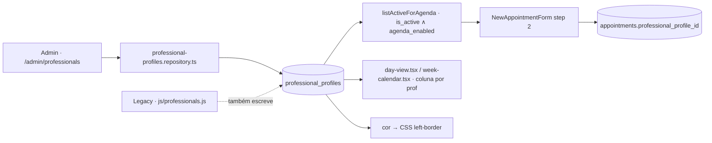
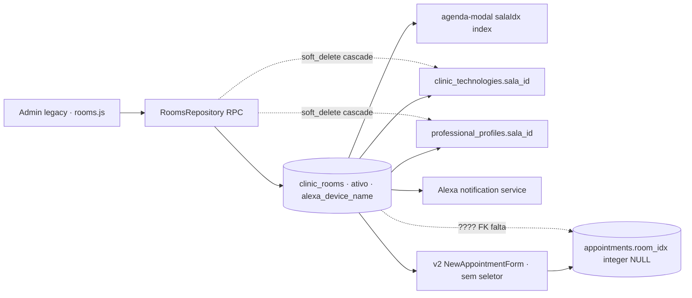

# 04 · Professionals · Procedures · Rooms — Data Lineage

> READ-ONLY · doc-only · 2026-05-18 · graph-driven

## A. PROFISSIONAIS

### Tabela canônica
`public.professional_profiles`
- Colunas-chave (mig série 408 multi-pro): `id uuid`, `clinic_id uuid`, `user_id uuid` (FK auth.users), `nome text`, `is_active boolean`, `agenda_enabled boolean`, `cor text` (left-border CSS), `sala_id uuid|integer` (default sala), `crm_uf text`, `categoria text`, `created_at`, `updated_at`
- RLS: `professional_profiles_select/insert/update/delete` per-clinic + role check (`app_role() IN ('owner','admin')`)
- Helpers: `app_clinic_id()` JWT-based · `app_role()`

### Legacy CRUD
| Operação | Path | Função |
|----------|------|--------|
| List | `js/professionals.js:11` | `getProfessionals()` (cache global) |
| Open modal | `js/professionals.js:216` | `openProfModal()` |
| Save | `js/professionals.js:489` | `saveProfessional()` |
| Render settings | `js/professionals.js` (community 366) | render list of profs |

### v2 CRUD
| Operação | Path | Função |
|----------|------|--------|
| List active for agenda | `packages/repositories/src/professional-profiles.repository.ts:82-102` | `listActiveForAgenda(clinicId)` filtra `is_active=true ∧ agenda_enabled=true` |
| Admin list | (a confirmar) | provavelmente `apps/lara/src/app/admin/professionals/page.tsx` |
| Mutations | repositório direto + server actions | – |

### Consumer screens
| Screen | Path | Uso |
|--------|------|-----|
| /crm/agenda day-view | `apps/lara/src/app/crm/agenda/_components/day-view.tsx` | renderiza coluna por profissional |
| /crm/agenda week-calendar | `apps/lara/src/app/crm/agenda/_components/week-calendar.tsx` | render multi-prof na semana |
| NewAppointmentForm step 2 | `_form.tsx` | select de profissional |
| Legacy agenda-modal | `js/agenda-modal.js:120-129` + L1425-1440 auto-link `prof.sala_id` |
| Legacy agenda-smart | `js/agenda-smart.js:586` `_buildPanel()` |

### Lineage (Mermaid)



### Gaps
- v2 não expõe **férias / blackout dates** por profissional (legacy tem em `professional_profiles.ferias`? a confirmar) — P1
- v2 não usa `professional_profiles.sala_id` para auto-link prof→sala no form — P1
- v2 não tem CRUD admin migrado (depende de v2 admin futuro) — P2

---

## B. PROCEDIMENTOS

### Tabela canônica
`public.clinic_procedimentos` (mig `20260541000000_clinic_procedimentos.sql`) + extensão `clinic_procedimentos_comercial` (mig 700/864 não auditado aqui).

**Colunas (combinadas das 6 migrations):**
- Base: `id uuid`, `clinic_id uuid`, `nome text` UNIQUE per clinic, `categoria text`, `descricao text`, `duracao_min int DEFAULT 60`, `sessoes int DEFAULT 1`, `tipo text DEFAULT 'avulso'`, `preco numeric(12,2)`, `ativo boolean DEFAULT true`, `created_at`, `updated_at`
- Mig 659 add: `preco_promo`, `custo_estimado`, `margem`, `combo_sessoes`, `combo_desconto_pct`, `combo_valor_final`, `combo_bonus`, `combo_descricao`, `usa_tecnologia`, `tecnologia_protocolo`, `tecnologia_sessoes`, `tecnologia_custo`, `cuidados_pre jsonb`, `cuidados_pos jsonb`, `contraindicacoes jsonb`, `observacoes`
- Mig 700/107: `intervalo_sessoes_dias int` (intervalo entre sessões)
- Mig 700/390: `fases jsonb` (multi-fase protocol)
- Mig 700/053: integração `partner_pricing_json` + FK `vpi_partners`

**Junctions:**
- `procedimento_insumos` (mig 541): `procedure_id`, `inj_id` (FK `clinic_injetaveis`), `qtd_por_sessao`
- `b2b_voucher_combos` (mig 700/723): combo packs com `b2b_voucher_combo_upsert`, `b2b_voucher_combos_list`, `b2b_voucher_combo_delete`

**Indexes:** `idx_procedimentos_clinic`, `idx_procedimentos_categoria`, `idx_procedimentos_ativo`, `idx_proc_insumos_proc`, `idx_proc_insumos_inj`

**RLS policies:** `procedimentos_select / insert / update / delete` + `proc_insumos_select / insert / update / delete` (admin/owner only writes)

**RPCs:**
- `get_procedimentos(p_apenas_ativos boolean)` retorna `clinic_procedimentos.*` + `insumos` jsonb
- `upsert_procedimento(p_id, p_nome, p_categoria, p_descricao, p_duracao_min, p_sessoes, p_tipo, p_preco, p_preco_promo, p_custo_estimado, p_margem, p_combo_*, p_usa_tecnologia, p_tecnologia_*, p_cuidados_pre, p_cuidados_pos, p_contraindicacoes, p_observacoes, p_fases, p_intervalo_sessoes_dias, p_insumos)` SECURITY DEFINER
- `soft_delete_procedimento(p_id)` SECURITY DEFINER
- `procedures_with_partner_pricing(p_lead_id)` (mig 700/053) retorna procedures com partner_pricing aplicado
- `vpi_is_active_partner(p_lead_id)` helper

### Legacy CRUD
| Operação | Path |
|----------|------|
| List | `js/repositories/procedimentos.repository.js:14-24` → RPC `get_procedimentos` |
| Upsert | L26-62 → RPC `upsert_procedimento` (22 params) |
| Soft delete | L64-72 → RPC `soft_delete_procedimento` |
| Cache | `window.ProcedimentosCache.get()` (`js/procedimentos.js`) session |
| Seeds | `js/procedimentos.js` `PROC_SEEDS` ~44 procedimentos hardcoded |
| Render admin | `js/procedimentos.js` (community 11) `procDelete` L1867 |

### v2 CRUD (parcial)
| Operação | Path |
|----------|------|
| List admin | `packages/repositories/src/procedure-admin.repository.ts:126-154` `list(filter)` SELECT direto · filtros: status, categoria, search, limit, offset |
| Get by id | L156-164 `getById(id)` |
| List categorias | L166-176 `listCategorias()` distinct |
| Counts | L178-207 `getCounts()` `{total, active, inactive, priceUndefined, withPromo}` |
| Get commercial (copilot read-only) | `procedure.repository.ts:200+` `getCommercial(p_only_revisado)` via RPC `get_procedimentos_comercial` (mig 700/869) com guardrail que bloqueia preços (L10-14) |
| **CREATE / UPDATE / DELETE** | **AUSENTE** em v2 · ainda depende de RPCs legacy via SDK |

### Consumer screens
| Screen | Path | Uso |
|--------|------|-----|
| Legacy agenda-modal | `js/agenda-modal.js:815` `apptAddProc()` · datalist `apptProcList` | multi-proc list |
| Legacy finalize | `js/agenda-smart.finalize.js:382` `_renderFinProcs()` + `addFinProc()` L419 |
| v2 NewAppointmentForm step 3 | `_form.tsx:69-248` · `ProcedureOption` interface · `__manual__` sentinel | single procedure só |
| Anamnesis builder | legacy `js/anamnese-builder.js` |

### Pricing tiers
1. `preco` (standard)
2. `preco_promo` (mig 659)
3. `combo_valor_final` (combo discount)
4. `procedures_with_partner_pricing(p_lead_id)` (partner VPI override)

### Lineage (Mermaid)

```mermaid
flowchart TB
  subgraph Legacy
    LA[procedimentos.js admin] --> LR[ProcedimentosRepository.upsert]
    LR -->|RPC| LP[(clinic_procedimentos · ativo · combo_* · fases · partner_pricing)]
    LP --> LC[ProcedimentosCache session]
    LC --> LM[agenda-modal _apptProcs · cortesia/retorno/fases]
    LM --> LF[finalize · merge agendados+realizados]
    LP --> PINS[(procedimento_insumos)]
    LP -.partner_pricing.-> VP[vpi_partners]
  end
  subgraph v2
    VA[procedure-admin.repository SELECT] --> LP
    LP --> VS[NewAppointmentForm step 3 · procedure_id|__manual__]
    VS --> VAP[(appointments.procedure_id + procedure_name snapshot)]
    LP --> VC[ProcedureRepository.getCommercial · sem preços]
    VC --> LARA[Copilot Lara · safe context]
  end
```

### Gaps
- **Multi-procedure** em v2 ausente (P0)
- **CRUD admin v2** ausente (P2 · admin pode usar legacy admin enquanto)
- **Partner pricing exposure** no form v2 ausente (P1)
- **fases jsonb** não mapeado em v2 (P2)
- **Insumos** não expostos em v2 (P3)

---

## C. SALAS

### Tabela canônica
`public.clinic_rooms` (mig `20260537000000_clinic_rooms.sql`)
- Colunas: `id uuid`, `clinic_id uuid`, `nome text` UNIQUE per clinic, `descricao text`, `ativo boolean DEFAULT true`, `alexa_device_name text` (mig 631), `created_at`, `updated_at`

### Migrations
- `20260537000000_clinic_rooms.sql` — base
- `20260631000000_alexa_integration.sql` — `alexa_device_name` + integration

### RPCs
- `get_rooms()` retorna ativas
- `upsert_room(p_id, p_nome, p_descricao, p_alexa_device_name)`
- `soft_delete_room(p_id)` · cascade NULL em `clinic_technologies.sala_id` e `professional_profiles.sala_id`

### Legacy CRUD
| Operação | Path |
|----------|------|
| List | `js/repositories/rooms.repository.js:14-22` |
| Get from cache | `js/rooms.js:12` `getRooms()` |
| Upsert | `js/repositories/rooms.repository.js:24-37` |
| Soft delete | L39-47 |
| Confirm delete UI | `js/rooms.js:227` `confirmDelete()` |
| Alexa settings | `js/alexa-settings.js` (community 170) |
| Alexa notify | `js/services/alexa-notification.service.js:99` `notifyArrival()` |

### Consumer screens
| Screen | Uso |
|--------|-----|
| Legacy agenda-modal | `js/agenda-modal.js:120-129` select index-based (`salaIdx`) · `js/agenda-modal.js:1425-1440` auto-link prof |
| Legacy agenda-validation | `js/agenda-validation.js:293-310` `checkRoomConflict()` → erro `"Conflito de sala: {nome} já está ocupada — {detalhes}."` |
| v2 NewAppointmentForm | **NÃO TEM seletor de sala** · só `counts.room` no conflict report |
| v2 appointment table | mig 62 `room_idx integer NULL` (index-based legacy carry-over) |

### Lineage (Mermaid)



### Gaps
- **Seletor de sala** ausente no form v2 (P0)
- **FK `room_id uuid`** ausente · v2 usa `room_idx integer` legacy carry-over (P2 · migration de schema)
- **Auto-link prof→sala** ausente em v2 (P1)
- **Alexa device** não exposto em v2 (P3 · não bloqueante até reintegrar Alexa)
- **Mensagem conflict detalhada** v2 só diz `"{N} appointment(s) na mesma sala"` sem nome do conflitante (P1)

---

## Arquivos auditados (read-only)

- Grafo legacy migrations: 537, 541, 659, 631, 700/053, 700/107, 700/390, 700/723
- Grafo legacy js: professionals.js (60/259/366), rooms.js (126), procedimentos.js (11/18), repositories/*.js
- Grafo v2 repositories: procedure-admin.repository.ts, procedure.repository.ts, professional-profiles.repository.ts, appointment.repository.ts
- Wiki v2: AppointmentRepository.md
- Wiki legacy: 20260413000000_appointments.md
