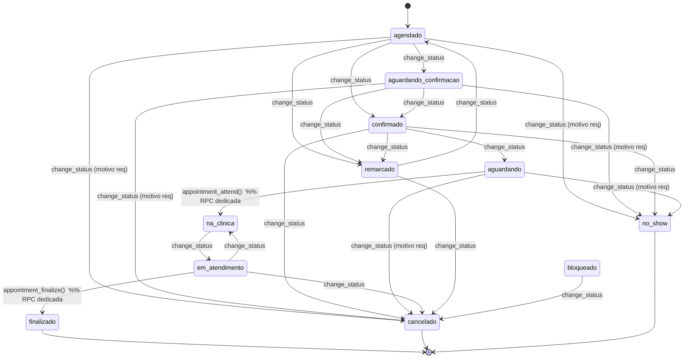

# 07 · Drag/Drop · Status State Machine

> READ-ONLY · doc-only · 2026-05-18 · CORREÇÃO: legacy TEM drag/drop (audit anterior errou)

## A. State Machines canônicas

### Legacy (`js/agenda-smart.constants.js:25-38`)

| From | To allowed |
|------|------------|
| `agendado` | `aguardando_confirmacao, confirmado, remarcado, cancelado, no_show` |
| `aguardando_confirmacao` | `confirmado, remarcado, cancelado, no_show` |
| `confirmado` | `aguardando, remarcado, cancelado, no_show` |
| `aguardando` | `na_clinica, no_show, cancelado` |
| `na_clinica` | `em_consulta` |
| `em_consulta` | `finalizado` |
| `em_atendimento` (legacy alias) | `finalizado, cancelado, na_clinica` |
| `finalizado` | — terminal |
| `remarcado` | `agendado, cancelado` |
| `cancelado` | — terminal |
| `no_show` | — terminal |
| `bloqueado` | `cancelado` |

### v2 (`packages/repositories/src/helpers/appointment-state.ts:19-53`)

| From | To allowed |
|------|------------|
| `agendado` | `agendado, aguardando_confirmacao, confirmado, remarcado, cancelado, no_show` |
| `aguardando_confirmacao` | `aguardando_confirmacao, confirmado, remarcado, cancelado, no_show` |
| `confirmado` | `confirmado, aguardando, remarcado, cancelado, no_show` |
| `aguardando` | `aguardando, na_clinica, no_show, cancelado` |
| `na_clinica` | `na_clinica, em_atendimento` |
| `em_atendimento` | `em_atendimento, finalizado, cancelado, na_clinica` |
| `finalizado` | — terminal |
| `remarcado` | `remarcado, agendado, cancelado` |
| `cancelado` | — terminal |
| `no_show` | — terminal |
| `bloqueado` | `bloqueado, cancelado` |

### Diferenças principais
| Aspecto | Legacy | v2 |
|---------|--------|----|
| `em_consulta` zumbi | presente | **eliminado** (só `em_atendimento`) |
| Self-loops idempotência | ausente | **presente** (todos não-terminais) |
| `pre_consulta` em confirmed | n/a | removido (audit anterior citou) |
| Terminais | finalizado, cancelado, no_show | mesmos |
| RPCs reservadas | – | `na_clinica` exige `appointment_attend()` · `finalizado` exige `appointment_finalize()` (mig 72) |

---

## B. Transition Matrix (45 transições)

| # | From | To | Legacy permite? | v2 client (`STATE_MACHINE`) | v2 server (RPC) | Tooltip se bloqueado | Risco |
|---|------|-----|-----------------|------------------------------|------------------|----------------------|-------|
| 01 | agendado → aguardando_confirmacao | ✅ | ✅ | ✅ via `appointment_change_status` | – | baixo |
| 02 | agendado → confirmado | ✅ | ✅ | ✅ | – | baixo |
| 03 | agendado → remarcado | ✅ | ✅ | ✅ | "Selecione novo horário" | baixo |
| 04 | agendado → cancelado | ✅ | ✅ | ✅ se motivo informado | "Motivo obrigatório" | baixo |
| 05 | agendado → no_show | ✅ | ✅ | ✅ se motivo informado | "Motivo obrigatório" | baixo |
| 06 | agendado → na_clinica | ❌ (precisa passar por aguardando) | ❌ direto | ❌ RPC `use_dedicated_rpc` se via change_status; `appointment_attend()` exige status anterior `confirmado` ou `aguardando` (a confirmar mig) | "Use 'Marcar chegada'" | médio |
| 07 | aguardando_confirmacao → confirmado | ✅ | ✅ | ✅ | – | baixo |
| 08 | aguardando_confirmacao → remarcado/cancelado/no_show | ✅ | ✅ | ✅ | – | baixo |
| 09 | confirmado → aguardando | ✅ | ✅ | ✅ | – | baixo |
| 10 | confirmado → cancelado/no_show/remarcado | ✅ | ✅ | ✅ (com motivo se cancel/no_show) | – | baixo |
| 11 | aguardando → na_clinica | ✅ | ✅ | ✅ via RPC `appointment_attend` (não `change_status`) | "Use 'Marcar chegada'" | **alto** · UI deve direcionar ao RPC correto |
| 12 | aguardando → no_show | ✅ | ✅ | ✅ com motivo | – | baixo |
| 13 | aguardando → cancelado | ✅ | ✅ | ✅ com motivo | – | baixo |
| 14 | na_clinica → em_consulta (legacy) | ✅ | ❌ status removido | ❌ | "Status legacy" | **alto** · DB pode ter rows com em_consulta antigas |
| 15 | na_clinica → em_atendimento (v2) | n/a | ✅ | ✅ via `change_status` | – | baixo |
| 16 | em_consulta → finalizado | ✅ | ❌ | ❌ | – | – |
| 17 | em_atendimento → finalizado | ✅ (alias) | ✅ | ✅ via RPC `appointment_finalize` (não `change_status`) | "Use 'Finalizar consulta'" | **alto** |
| 18 | em_atendimento → cancelado/na_clinica | ✅ | ✅ | ✅ | – | baixo |
| 19 | finalizado → * | ❌ terminal | ❌ | ❌ idempotent_skip | "Consulta finalizada" | – |
| 20 | cancelado → * | ❌ terminal | ❌ | ❌ | "Consulta cancelada" | – |
| 21 | no_show → * | ❌ terminal | ❌ | ❌ | "Cliente faltou" | – |
| 22 | remarcado → agendado | ✅ | ✅ | ✅ | – | baixo |
| 23 | remarcado → cancelado | ✅ | ✅ | ✅ | – | baixo |
| 24 | bloqueado → cancelado | ✅ | ✅ | ✅ | – | baixo |
| 25-45 | self-loops (v2 only) | ❌ | ✅ idempotência | ✅ `idempotent_skip` | – | baixo |

## Códigos de erro RPC (mig 72 + 167)
- `no_clinic_in_jwt` (tenant guard)
- `appointment_not_found`
- `invalid_status` (não está no enum)
- `use_dedicated_rpc` (tentando ir pra na_clinica/finalizado via change_status)
- `invalid_transition` (não permitido pela matriz)
- `missing_reason` (cancelado/no_show sem motivo)
- `idempotent_skip` (mesma transição → no-op)

---

## C. Drag/Drop

### Legacy (CORREÇÃO · audit anterior dizia ausente, ERRADO)

**Arquivos**: `js/api.js` (community 4/16)
- `agendaDrop(event)` `api.js:1144` — handler do drop
- `_applyDrag()` `api.js:1208` — aplica a mudança após confirm
- `showDragConfirm(novoSlot, conflito?)` `api.js:1173` — modal de confirmação
- Listeners no DOM via `ondragstart="..."` / `ondragover="..."` / `ondrop="agendaDrop(event)"` (HTML5 native)
- Cards arrastáveis: status ≠ NO_DRAG_STATUSES (legacy define `{'finalizado'}` apenas em `agenda-validation.js` constants)
- Conflict check: `AgendaValidator.checkProfConflict` / `checkRoomConflict` / `checkPatientConflict`
- Confirm: se conflito → mostra dialog "Conflito com {nome}. Confirma mudança?" · cancel preserva original

### v2 (`@dnd-kit`)

**Arquivos** (community 134):
- `apps/lara/src/app/crm/agenda/_components/day-view.tsx`
  - `handleDragEnd()` L103
  - `DayDroppableSlot` L227-250 · `useDroppable({id: slotId})` · slotId `slot_{date}_{HH:MM}`
  - `DayAppointmentBlock` L257-299 · `useDraggable({id: a.id, disabled: !draggable})`
- `apps/lara/src/app/crm/agenda/_components/week-calendar.tsx`
  - `handleDragEnd()` L141
- `apps/lara/src/app/crm/agenda/_components/_drag-utils.ts`
  - `DRAGGABLE_STATUSES = {agendado, aguardando_confirmacao, confirmado, aguardando}` L26-35
  - `normalizeHms(time)` L45
  - `parseSlotId(slotId)` L78-80
  - `detectDropConflict(candidate, all)` L99-128 → `appointmentsOverlap` (`helpers/appointment-state.ts:216`)

**Server validation** (`apps/lara/src/app/crm/_actions/appointment.actions.ts:709-784`):
- `dragDropAppointmentAction({appointmentId, slotId, forceOverride?})`
- Re-roda `checkConflicts()` repository method
- Retorna `fail('conflict', { counts })` se conflito
- `forceOverride: true` bypassa check (admin UX não exposto)

### Conflict messages (verbatim)

| Origem | Mensagem |
|--------|----------|
| Legacy `showDragConfirm` | `"Conflito com {prof|sala|paciente}: {nome} às {HH:MM}. Confirma mudança?"` (a confirmar formato exato) |
| v2 `day-view.tsx:134` | `"Conflito · {subjectName} já ocupa esse horário"` |
| v2 fallback `day-view.tsx:149` | `"Conflito de horário · escolha outro slot"` |
| v2 erro genérico `day-view.tsx:157` | `"Falha ao mover · {error.message}"` |

### Optimistic UI + Rollback
| Aspecto | Legacy | v2 |
|---------|--------|----|
| Optimistic | sim · move UI antes do save | **não** · espera server, depois `router.refresh()` |
| Rollback | sim · se `_applyDrag` falhar | n/a (não move antes) |
| Busy state | implícito | `setBusy(true)` em `handleDragEnd` (L104-161) |

### Override admin
- Legacy: dialog confirm com "Forçar" implícito (a confirmar)
- v2: param `forceOverride: true` no action, **UI não expõe** (P3)

---

## D. Mermaid state diagram

---

## E. Gap list

| ID | Gap | Severidade |
|----|-----|------------|
| G07-SM-01 | `em_consulta` zumbi pode existir em DB legacy data | P2 (migração de dados) |
| G07-SM-02 | UI v2 não distingue chamada de RPC dedicada (`change_status` vs `appointment_attend` vs `appointment_finalize`) — usuário confunde | P1 |
| G07-DND-01 | Audit anterior afirmava legacy não tem drag/drop · ERRADO | corrigido aqui |
| G07-DND-02 | v2 sem optimistic UI (pior UX em conexão ruim) | P2 |
| G07-DND-03 | v2 conflict message sem nome do conflitante | P1 |
| G07-DND-04 | v2 override admin não exposto na UI | P3 |
| G07-SM-03 | Self-loops idempotência: v2 melhor | – ✅ |
| G07-SM-04 | RPC dedicada: v2 melhor (atendimento → na_clinica, finalize → finalizado atômicos) | – ✅ |

## Arquivos auditados

- Grafo legacy: api.js community 4/16 (`agendaDrop` L1144, `_applyDrag` L1208, `showDragConfirm` L1173), agenda-smart.js (27), agenda-smart.constants.js, agenda-validation.js (211)
- Grafo v2: helpers/appointment-state.ts (67), day-view.tsx (134), week-calendar.tsx (134), _drag-utils.ts (134), appointment.actions.ts (11)
- Migs: 62, 72, 151, 167
