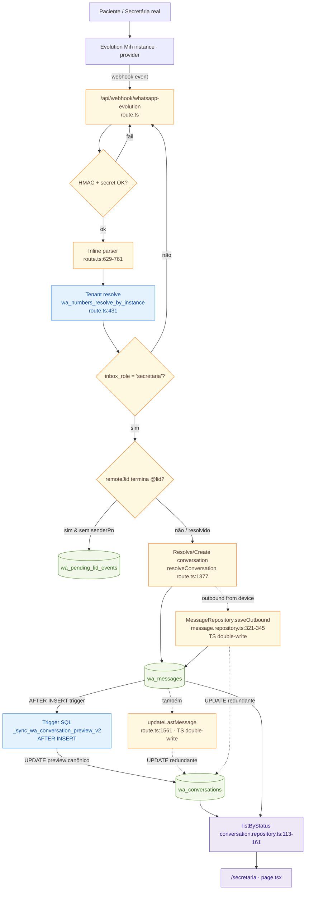
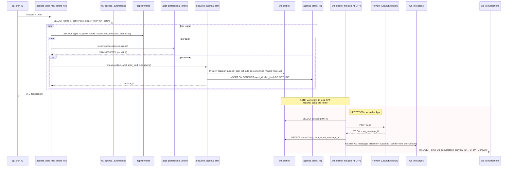
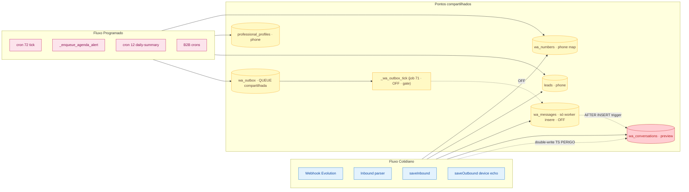

# Mapa Visual · Fluxos Secretaria/Mih (2986) · 2026-05-11

> Companheiro de [isolation-audit.md](2026-05-11-secretaria-2986-isolation-audit.md).
>
> Cinco diagramas:
> 1. Fluxo Cotidiano ponta a ponta (inbound real)
> 2. Fluxo Programado ponta a ponta (agenda/CRM/outbox)
> 3. Sequence diagram do fluxo programado
> 4. Mapa de convergência (onde os 2 fluxos se encontram)
> 5. Mapa de risco (verde/amarelo/vermelho)

---

## Diagrama 1 — Fluxo Cotidiano (inbound real do paciente / outbound real da secretária)



**Lendo o diagrama:**
- Caminho azul (SQL) = canônico, robusto.
- Caminho amarelo (TS) = código aplicativo. **Os 2 nodes "double-write"** são as redundâncias que duplicam o trigger SQL.
- O dash lê de `wa_conversations` (preview) e ocasionalmente de `wa_messages` (thread).

---

## Diagrama 2 — Fluxo Programado (agenda/CRM gera mensagem que TALVEZ saia pelo Mih ou Lara)

```mermaid
flowchart TD
  classDef sql fill:#e3f2fd,stroke:#1976d2,color:#0d47a1
  classDef db fill:#f1f8e9,stroke:#558b2f,color:#33691e
  classDef cron fill:#fce4ec,stroke:#c2185b,color:#880e4f
  classDef off fill:#ffebee,stroke:#c62828,color:#b71c1c
  classDef on fill:#e8f5e9,stroke:#2e7d32,color:#1b5e20

  CRON72[cron job 72<br/>agenda_alert_min_before_tick<br/>*/1 * * * * · ATIVO dry-run]:::on
  CRON12[cron job 12<br/>daily-agenda-summary<br/>0 11 * * * · ATIVO]:::on
  CRON71[cron job 71<br/>wa_outbox_worker_tick<br/>*/1 * * * * · DESLIGADO]:::off
  CRON9[cron job 9<br/>wa-outbox-cleanup<br/>*/5 · ATIVO · só limpa]:::on
  CRONB2B[crons b2b_cron_*<br/>mensais · ATIVOS]:::on

  TICK[_agenda_alert_min_before_tick]:::sql
  ENQ[_enqueue_agenda_alert<br/>mig 156 + mig 158 NULLIF]:::sql
  PHONE[_appt_professional_phone]:::sql
  SUMMARY[wa_daily_summary]:::sql
  WORKER[_wa_outbox_tick · WORKER]:::off

  APPT[(appointments)]:::db
  RULES[(wa_agenda_automations)]:::db
  PROF[(professional_profiles)]:::db
  OUTBOX[(wa_outbox)]:::db
  ALOG[(agenda_alerts_log<br/>UNIQUE appt_id, alert_kind)]:::db
  WAMSG[(wa_messages)]:::db
  WACONV[(wa_conversations)]:::db
  EVOPROVIDER[Provider · Cloud OR Evolution]

  CRON72 -->|chama a cada min| TICK
  TICK -->|lê regras ativas| RULES
  TICK -->|busca appts na janela| APPT
  TICK -->|chama com appt| ENQ
  ENQ -->|resolve phone| PHONE
  PHONE --> PROF
  ENQ -->|INSERT row queued| OUTBOX
  ENQ -->|INSERT idempotente| ALOG

  CRON12 -->|chama 11h diário| SUMMARY
  SUMMARY -->|INSERT broadcast queued| OUTBOX

  CRONB2B -.gera dispatch B2B.-> OUTBOX

  OUTBOX -.lê queued.- WORKER
  WORKER -.OFFLINE: caso ON, chamaria provider.- EVOPROVIDER
  WORKER -.OFFLINE: caso ON, MessageRepository.saveOutbound.- WAMSG
  WAMSG -.AFTER INSERT trigger.-> WACONV

  CRON9 -->|DELETE rows sent old| OUTBOX
```

**Lendo o diagrama:**
- Verde = está ligado.
- Vermelho = **off** (worker job 71 desligado é o gate atual de envio real).
- Linhas pontilhadas = "se ligado / quando ligado".
- **`wa_outbox` é o ponto de espera**. Mensagens programadas se acumulam ali.
- **`agenda_alerts_log` é o gate de idempotência.** Garante que o mesmo alerta para o mesmo appt não enfileira 2x.
- Programado NUNCA escreve em `wa_messages` ou `wa_conversations` diretamente. Só via worker, que está OFF.

---

## Diagrama 3 — Sequence do fluxo programado (quando ativado)



**Observação crítica:** o **único caminho legítimo** para um conteúdo programado se tornar visível na conversa real é via `INSERT em wa_messages` pelo worker **após confirmação do provider**. Nenhum atalho.

---

## Diagrama 4 — Mapa de Convergência



**Pontos seguros (amarelo):**
- `wa_numbers`, `professional_profiles`, `leads` — read-only para ambos, sem conflito.
- `wa_outbox` — fila exclusiva do programado; cotidiano não lê nem escreve aqui.
- `_wa_outbox_tick` — worker é o **único ponto de cruzamento legítimo** (atualmente OFF).

**Ponto perigoso (vermelho):**
- `wa_conversations` — fonte da verdade do preview. Escrito por:
  1. Trigger SQL canônico (`_sync_wa_conversation_preview_v2`) via INSERT em `wa_messages`.
  2. **Double-write TS** do webhook Evolution (line 1561).
  3. **Double-write TS** de `saveOutbound` (line 321-345).

---

## Diagrama 5 — Mapa de Risco

```mermaid
flowchart TB
  classDef green fill:#c8e6c9,stroke:#2e7d32,color:#1b5e20
  classDef yellow fill:#fff9c4,stroke:#f9a825,color:#6d4c41
  classDef red fill:#ffcdd2,stroke:#c62828,color:#b71c1c
  classDef gate fill:#e1bee7,stroke:#6a1b9a,color:#4a148c

  subgraph GREEN[ZONA VERDE · ISOLADO E ROBUSTO]
    G1[Trigger SQL _sync_wa_conversation_preview_v2<br/>guards · EXCEPTION handler · canônico]:::green
    G2[wa_outbox sem trigger que toque wa_conversations]:::green
    G3[agenda_alerts_log UNIQUE appt_id, alert_kind<br/>idempotência garantida]:::green
    G4[_enqueue_agenda_alert mig 156+158<br/>guards lead_id, phone, NULLIF content]:::green
    G5[wa_pending_lid_events isolado<br/>não toca conversa]:::green
  end

  subgraph GATE_LAYER[GATE OPERACIONAL]
    GW[cron job 71 wa_outbox_worker_tick · OFF<br/>impede envio + impede insert em wa_messages]:::gate
  end

  subgraph YELLOW[ZONA AMARELA · ATENÇÃO]
    Y1[Double-write TS<br/>webhook Evolution route.ts:1561 + saveOutbound:321<br/>redundante mas não quebra preview]:::yellow
    Y2[B2B crons 26-33 · enqueue mensal<br/>worker OFF protege]:::yellow
    Y3[wa_daily_summary insere outbox sem conversation_id<br/>broadcast-like · sem preview update]:::yellow
    Y4[Conversa reativa archived→active em saveOutbound<br/>comportamento intencional · ok]:::yellow
  end

  subgraph RED[ZONA VERMELHA · QUEBRA PROVÁVEL]
    R1[🔴 listByStatus sem wa_number_id<br/>mistura Mih + Mira + Marci + Aux]:::red
    R2[🔴 getSecretariaKpiCounts sem wa_number_id<br/>KPIs inflados]:::red
    R3[🟠 Preview drift residual ~10 convs Mih<br/>até 24h atrasado vs MAX sent_at<br/>resíduo do trigger zumbi 2026-05-04]:::red
    R4[🔴 Query ordena por last_message_at sem fallback<br/>drift faz convs frescas afundarem]:::red
    R5[🟡 Mismatch silencioso quando trigger zumbi recidiva<br/>sem health-check / alerta]:::red
  end

  GREEN --> GATE_LAYER
  GATE_LAYER --> YELLOW
  YELLOW --> RED
```



**Lendo o mapa:**

- **Verde:** o que está bem isolado e correto. Trigger SQL é a estrela; `wa_outbox` e `agenda_alerts_log` não sangram.
- **Gate:** **job 71 OFF** é o único motivo de não termos um vazamento operacional sério. Quando ele ligar, a zona amarela precisa estar limpa.
- **Amarelo:** double-write TS, B2B crons, broadcast — funcionam, mas precisam ser limpos antes de produção plena.
- **Vermelho:** o que está quebrando agora. Defeitos 1, 2, 4 são o que torna o dash "vazio/stale". Defeito 5 é a falta de alarme caso 2026-05-04 se repita.

---

## Resumo executivo dos diagramas

| Diagrama | Mostra | Lição |
|---|---|---|
| 1 (Cotidiano) | Path real Evolution → wa_messages → preview | Trigger SQL canônico + double-write TS redundante |
| 2 (Programado) | Path tick → outbox → worker (off) | Programado NÃO toca conversa enquanto worker está OFF |
| 3 (Sequence) | Como agenda alert vira mensagem (hipotético) | Único caminho legítimo: worker INSERT em wa_messages → trigger atualiza preview |
| 4 (Convergência) | `wa_conversations` é o único ponto vermelho real | Compartilhamento existe, mas via trigger SQL é seguro |
| 5 (Risco) | Verde / Amarelo / Vermelho | Vermelho = query do dash + drift residual. Verde = SQL layer. Amarelo = TS redundante |
